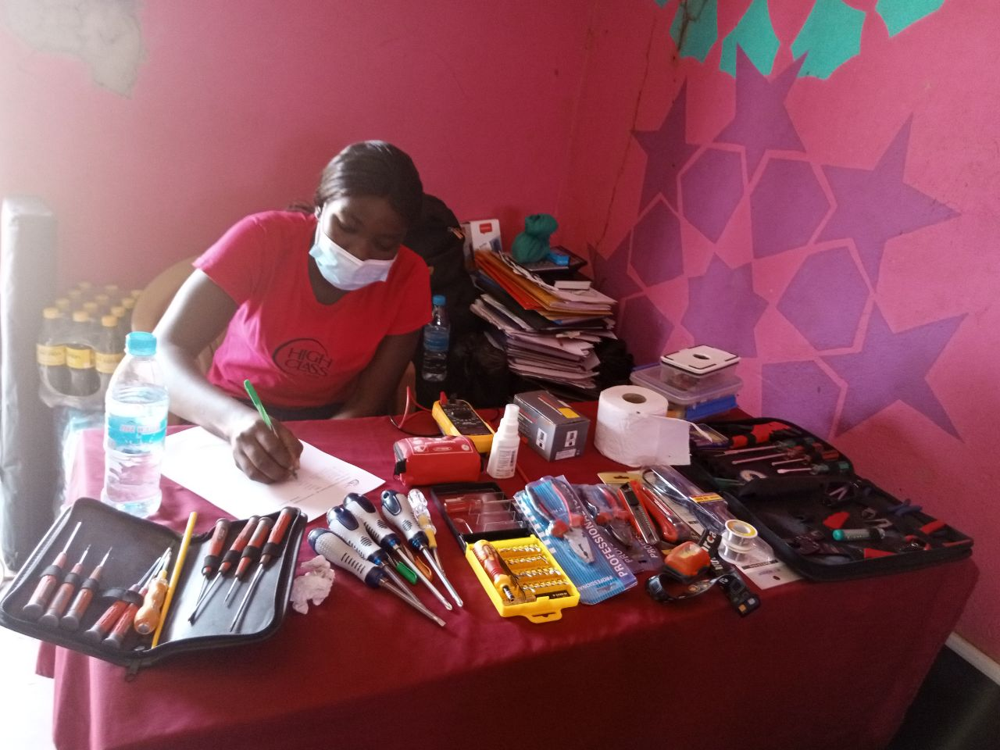

# Minimal-Repair-Setup
> What are the most important tools and materials to have available when doing a repair session?

## Minimal Set
- Screw drivers set
- Soldering Kit
- Soldering Wire
- Multimeter

## Other Ideas
Also check this out: https://wikifab.org/wiki/Repair_Cafe%27

### TOOLS
- power source
- digital multimeter
- notebook, pens,
- trays for parts,
- headlamp or flashlight,
- magnifying glass,
- Torch / soldering iron(s) & sucker, solder,

# MATERIALS
- wires
- soldering oil/grease
- some few electrical components
- (resistors,diode,capacitors,etc)
- radio volume controllers
- mouth pieces
- FM aerials
- charging ports for phones
- Earpiece
- phone terminals
- phone screen,some pieces

 # option one

 There are 64pieces of tools in the kit,these include:

- Tweezer

- Plier

- Box spanners. 4,5,6,7,8,9,10,11,12 and 13

- Network cable crimping tool

- Tape measure (3m)

- Digital a/c/Dc tester

- Radio set(6pieces)

- phone set(10pieces)

- Multimetre

- Sole tape

- Wire cutter

- Soldering wire

- Soldering gun (60wts)

- Solder sucker

- Soldering gun stand
  
# option two

- Soldering gun

- Radio set(05) pieces

- phone set(12) pieces

- Magnifying glass

- Soldering wire

- Digital multimetre

# option three

- wizard Wire strainer

- Wire cutter

- needle nose pliers

- Allein key(5)pieces

- Radio set(5)pieces

- solder sucker

- Digital multimetre

- 3 metre tape measure

- Phone set(6)pieces

- Box spanners 4,5,6,7,8,9,10,11,12and13

- Gripper

# option four

- 2 computer blowers

- 1 computer cleaner

- 3 pen testers

- 1 soldering gun

- 2 rolls of soldering wire

- 1 wire cutter

# option five

- phone set(4)

- Magnifying lens 

- Digital multimeter

- Soldering gun(2) 30wts

- Soldering paste

- Head light

- Wire cutter

- 2 pen testers

- Soldering wire (1roll)

- Soldering gun stand

- Tape measure(3metres)

- Sole tape.
# sitting arrangement(Set up)

